# 📘 Attendance Portal

A comprehensive attendance management system for educational institutions.

## 🚀 Features

- User authentication with role-based access control
- Attendance tracking and management
- Leave request system
- Dashboard for different user roles (Admin, Staff, Student, HOD, Principal, Placement Officer)
- Real-time attendance monitoring
- Reports and analytics

## 🧰 Tech Stack

- Frontend: React.js with Material-UI
- Backend: Node.js with Express
- Database: MySQL
- Authentication: JWT

## 📦 Prerequisites

- Node.js (v14 or higher)
- MySQL (v8.0 or higher)
- npm or yarn

## Setup Instructions

1. Clone the repository:
```bash
git clone https://github.com/madhan404/biometric_attendance_portal.git
cd attendance-portal
```

2. Install dependencies:
```bash
# Install backend dependencies
cd backend
npm install

# Install frontend dependencies
cd ../frontend
npm install
```

3. Configure environment variables:
   - Create `.env` file in the backend directory
   - Add the following variables:
```
DB_NAME=your_database_name
DB_USER=your_database_user
DB_PASS=your_database_password
DB_HOST=your_database_host
JWT_SECRET=your_jwt_secret
PORT=your_port_number
REACT_APP_API_URL=http://localhost:3001/api
```

4. Import the database:
```bash
mysql -u root -p att < att_backup.sql
```

5. Start the development servers:
```bash
# Start backend server
cd backend
npm run dev

# Start frontend server
cd frontend
npm run dev
```

## 🚀 Deployment

1. Build the frontend:
```bash
cd frontend
npm run build
```

2. Configure production environment variables

3. Start the production server:
```bash
cd backend
npm start
```

## 🗄️ Database Migration

To migrate the database to a new server:

1. Export the database:
```bash
mysqldump -u root -p att > att_backup.sql
```

2. Import to the new server:
```bash
mysql -u root -p att < att_backup.sql
```

## 🤝 Contributing

1. Fork the repository
2. Create your feature branch
3. Commit your changes
4. Push to the branch
5. Create a new Pull Request

## 🖼️ Screenshots

### 🔐 Login Page  


### 🛠️ Admin Dashboard  
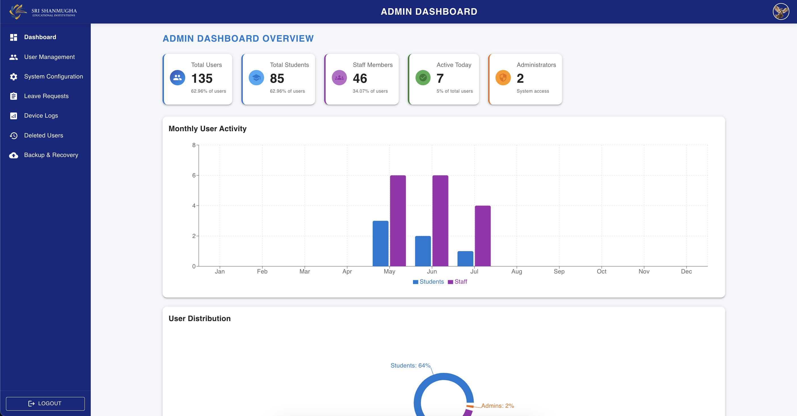

### 👨‍🏫 Staff Dashboard  
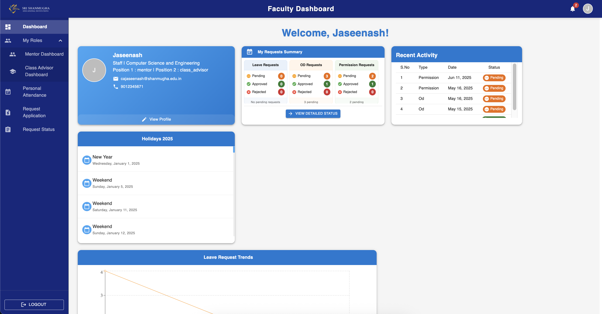

### 👨‍🏫 Principal Dashboard  
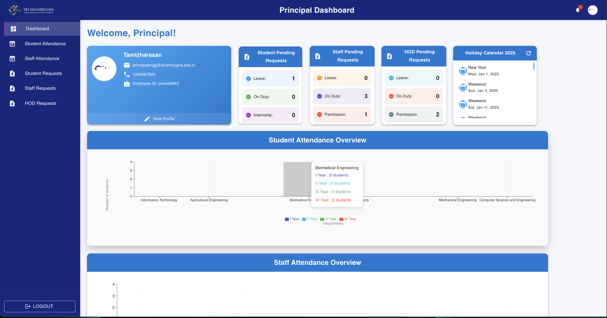

### 🧑‍💼 HOD Dashboard  
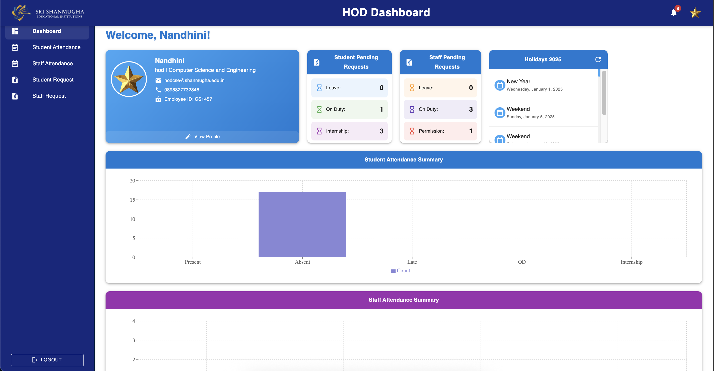

### 🧑‍🏫 Mentor Dashboard  
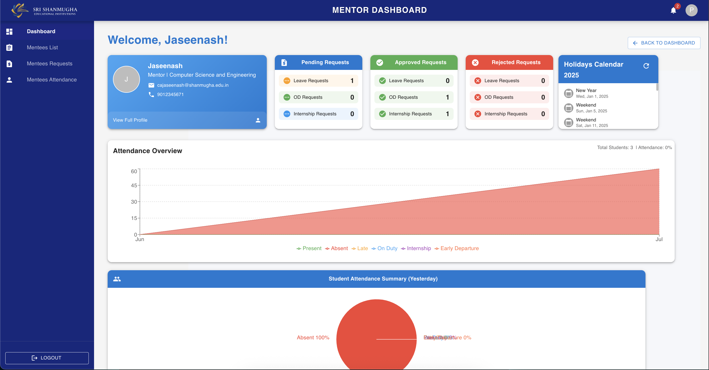

### 📚 Class Advisor Dashboard  
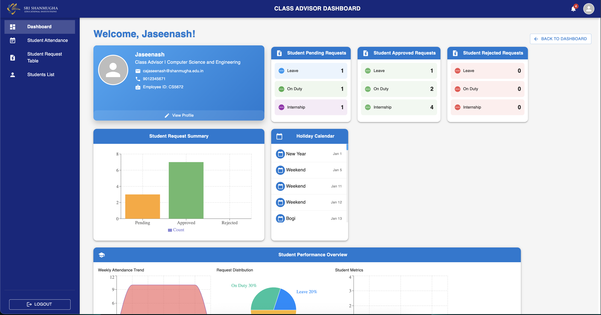

### 🧑‍🎓 Class Advisor – Student List  
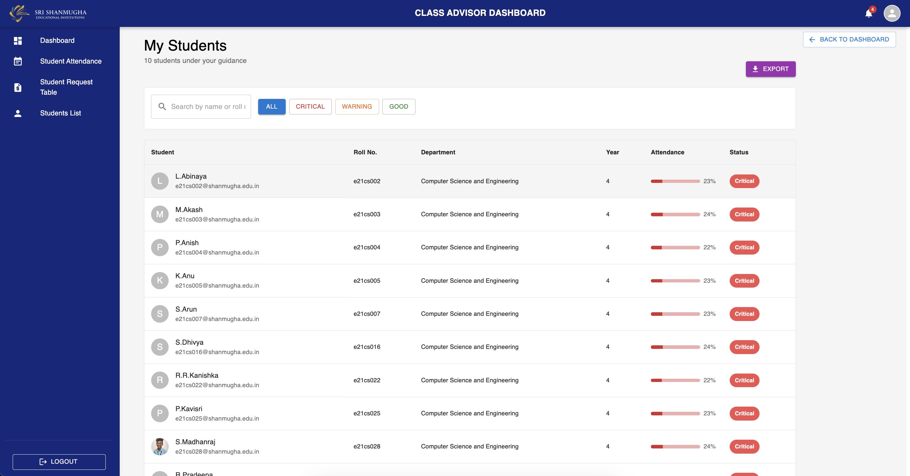

### 👥 Mentees List  


### 👤 All Users  
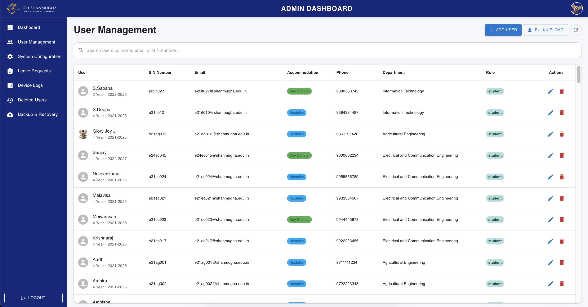

### 🗑️ Deleted Users  
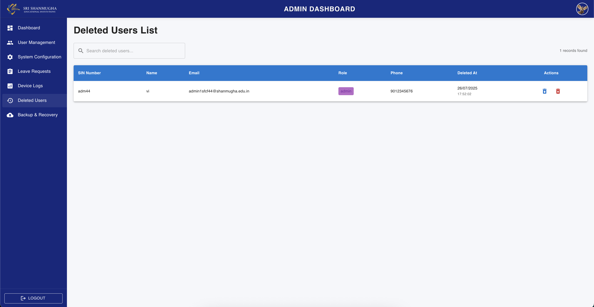

### 🎓 Student Dashboard  
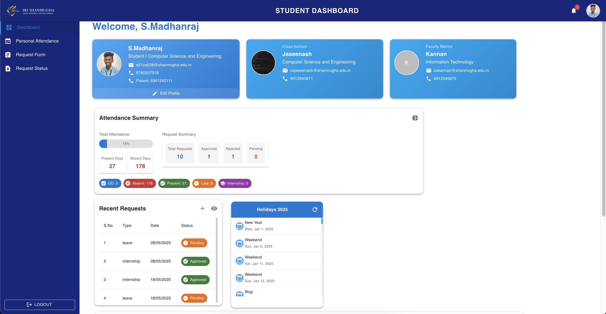

### 📝 Student Application  
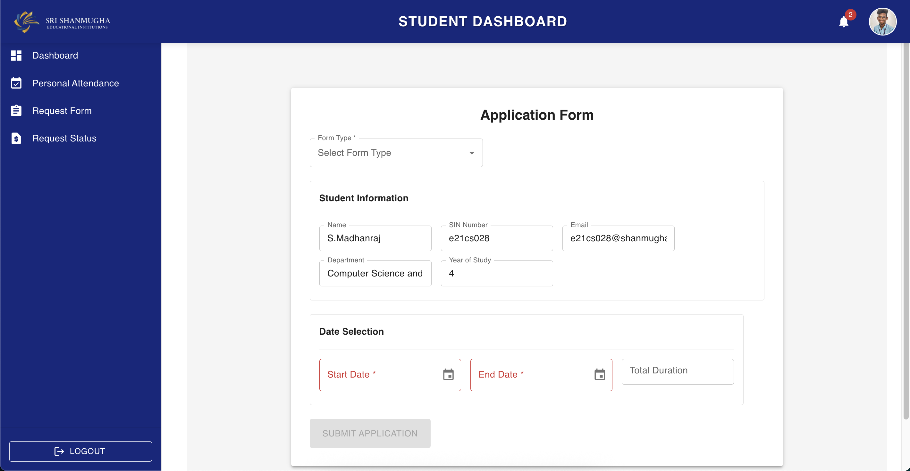

### 🕒 Student Attendance  
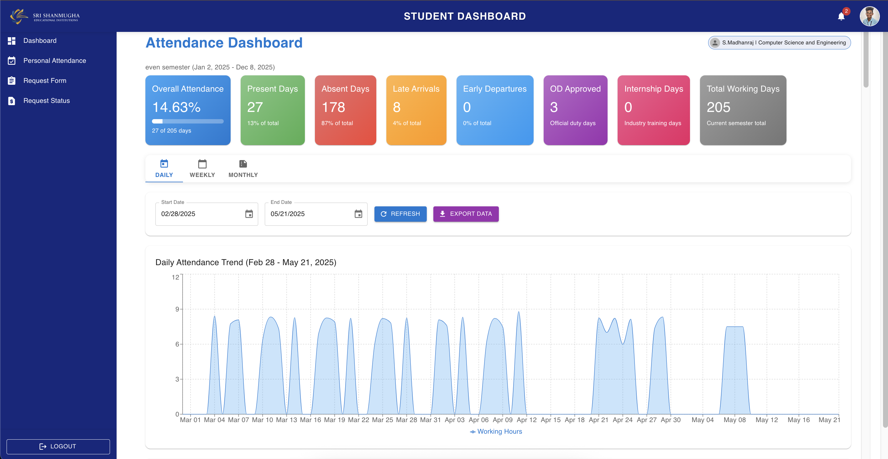

### 🏖️ Student Leave Status  
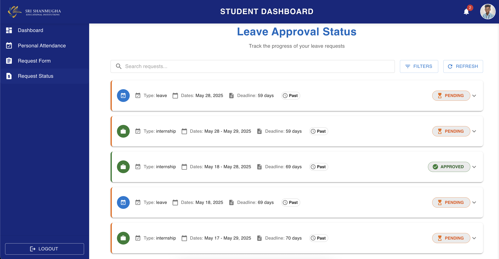

### 📩 All Leave Requests  
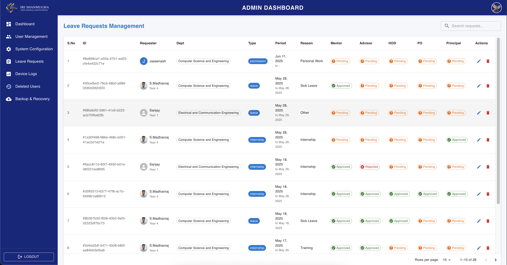

### 🧾 Total Student List  
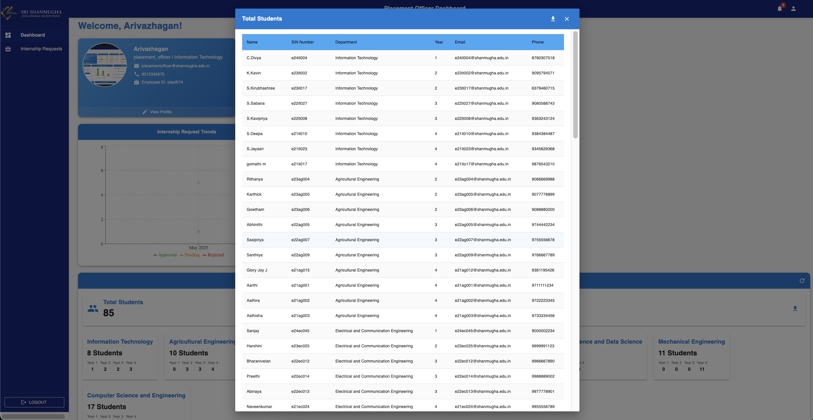

### 🧑‍💼 Placement Officer Dashboard  
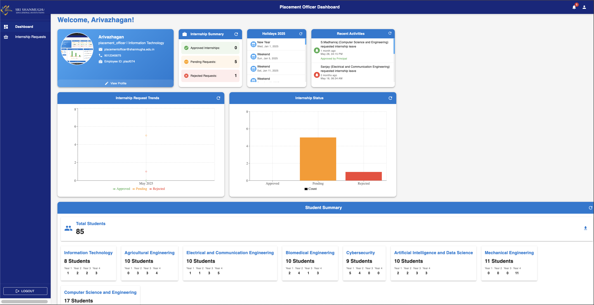

### 📊 Device Logs Analytics  


### ⚙️ System Configuration  
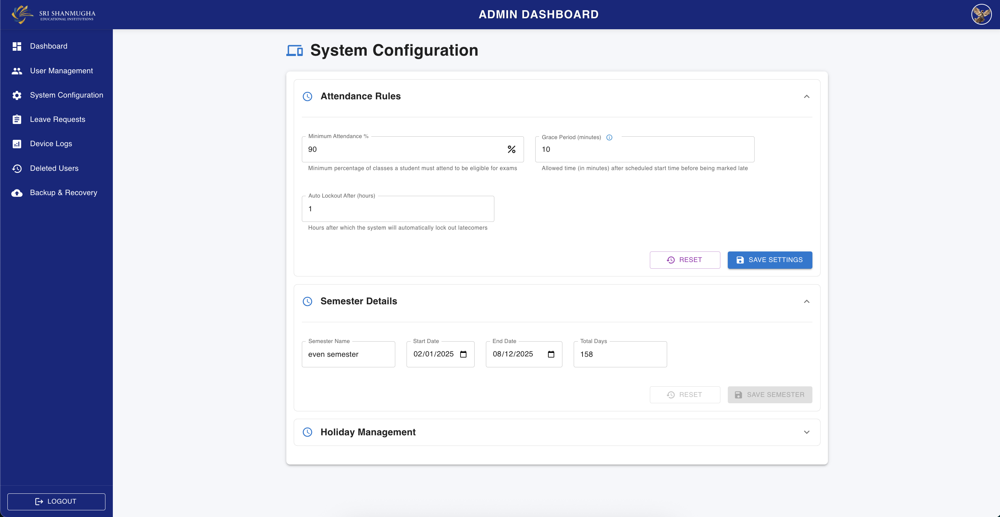

### 💾 Backup  
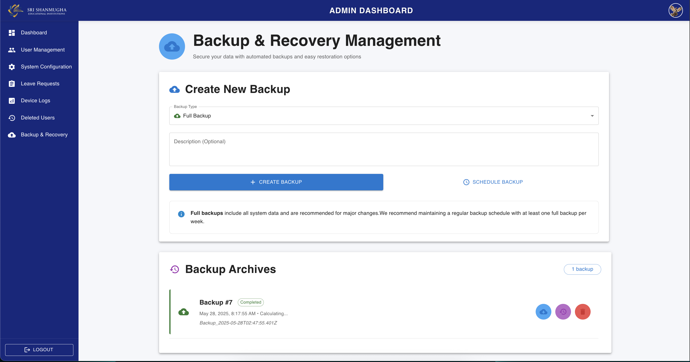


## 📄 License

This project is licensed under the MIT License. See the [LICENSE](LICENSE) file for details.
